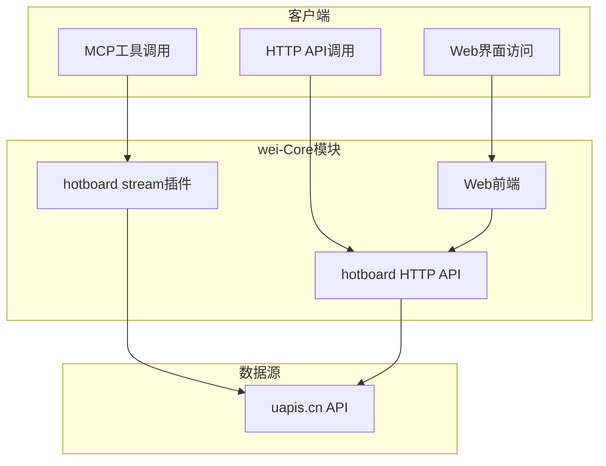

<div align="center">
# wei-Core
</div>

<div align="center">
  
  <h3>热榜查询核心模块</h3>
  <p>快速获取多平台实时热点数据，掌握网络动态</p>
</div>

## 模块简介

wei-Core XRK-AGT 平台的核心模块之一，专注于提供高效的热榜查询功能。它整合了多个主流平台的实时热点数据，帮助用户快速掌握网络动态。

### 核心特性

- **多平台支持**：覆盖视频/社区、新闻/资讯、技术/IT、游戏等多个领域的热门平台
- **多接口调用**：支持通过 MCP 工具、HTTP API 或 Web 界面获取热榜数据
- **实时数据**：直接对接官方 API，获取最新热榜信息
- **响应式设计**：Web 界面适配桌面和移动设备
- **易于集成**：标准化的接口设计，方便与其他模块集成

## 功能说明

### 热榜查询

通过 `hotboard` 工作流插件，可查询以下平台的热榜数据：

#### 支持的平台分类

| 分类 | 平台列表 |
|------|----------|
| **视频/社区** | bilibili, acfun, weibo, zhihu, douyin, kuaishou, douban-movie, tieba, hupu, v2ex |
| **新闻/资讯** | baidu, thepaper, toutiao, qq-news, sina, netease-news, huxiu |
| **技术/IT** | sspai, ithome, juejin, jianshu, guokr, 36kr, 51cto, csdn |
| **游戏** | lol, genshin, honkai, starrail |
| **其他** | weread, weatheralarm, earthquake, history |

## 安装与使用

### 安装
```bash
git clone https://github.com/liuyingjiang-wei/wei-Core.git
```

### 使用方法

#### 通过 MCP 工具调用

1. **查询热榜**：调用 `hotboard.get_hotboard` 工具，指定平台类型

   ```javascript
   // 调用示例：查询微博热搜
   const result = await context.callTool('hotboard.get_hotboard', {
     type: 'weibo'
   });
   ```

2. **返回数据结构**：

   ```javascript
   {
     "success": true,
     "data": {
       "type": "weibo",
       "update_time": "2026-01-30 21:41:25",
       "list": [
         {
           "index": 1,
           "title": "警方通报金晨事件",
           "hot_value": "4977568",
           "url": "https://s.weibo.com/weibo?q=%23%E8%AD%A6%E6%96%B9%E9%80%9A%E6%8A%A5%E9%87%91%E6%99%A8%E4%BA%8B%E4%BB%B6%23"
         },
         // 更多热榜条目...
       ]
     }
   }
   ```

## 插件列表

| 插件名称 | 类型 | 功能说明 | 文件路径 |
|---------|------|---------|----------|
| hotboard | stream | 热榜查询工作流，支持多个平台的实时热榜数据 | stream/hotboard.js |
| hotboard | http | 热榜查询 API，提供 RESTful 接口获取热榜数据 | http/hotboard.js |


#### 通过 HTTP API 调用

1. **获取指定平台热榜**：
   ```bash
   # 请求示例
   curl "http://localhost:2537/api/hotboard?type=weibo"
   ```

2. **获取支持的平台列表**：
   ```bash
   # 请求示例
   curl "http://localhost:2537/api/hotboard/platforms"
   ```

#### 通过 Web 界面访问

直接在浏览器中访问：`http://localhost:2537/hotboard`

## 插件列表

| 插件名称 | 类型 | 功能说明 | 文件路径 |
|---------|------|---------|----------|
| hotboard | stream | 热榜查询工作流，支持通过 MCP 工具获取热榜数据 | stream/hotboard.js |
| hotboard | http | 热榜查询 API，提供 RESTful 接口获取热榜数据 | http/hotboard.js |

## HTTP API 文档

### 接口列表

| 接口路径 | 方法 | 功能说明 | 参数 |
|---------|------|---------|------|
| `/api/hotboard` | GET | 获取指定平台的热榜数据 | `type` (平台类型，如 weibo、bilibili 等) |
| `/api/hotboard/platforms` | GET | 获取支持的平台列表 | 无 |

### 返回格式

```json
{
  "success": true,
  "message": "操作成功",
  "type": "weibo",
  "update_time": "2026-01-30 21:41:25",
  "list": [
    {
      "index": 1,
      "title": "警方通报金晨事件",
      "hot_value": "4977568",
      "url": "https://s.weibo.com/weibo?q=%23%E8%AD%A6%E6%96%B9%E9%80%9A%E6%8A%A5%E9%87%91%E6%99%A8%E4%BA%8B%E4%BB%B6%23"
    }
  ]
}
```

## WWW 业务层

### 热榜查询页面

- **访问路径**：`/wei-Core/www/hotboard`
- **功能**：提供直观的热榜查询界面，支持按分类选择平台，实时显示热榜数据
- **特点**：
  - 响应式设计，适配桌面和移动设备
  - 分类展示平台，方便用户选择
  - 实时显示热榜排名、标题和热度
  - 支持刷新功能，获取最新数据

### 页面结构

| 文件名称 | 功能说明 |
|---------|---------|
| `index.html` | 页面 HTML 结构 |
| `styles.css` | 页面样式 |
| `app.js` | 前端交互逻辑 |

## 技术实现

### 核心技术

- **基于 AIStream 基类**：遵循 XRK-AGT 的工作流规范
- **使用原生 fetch API**：调用 `https://uapis.cn/api/v1/misc/hotboard` 接口
- **完整的错误处理**：处理网络错误、API 错误等情况
- **数据格式化**：返回标准化的热榜数据结构
- **上下文管理**：将查询结果存储到上下文，便于后续使用

### 架构设计



## 配置说明

wei-Core 模块无需特殊配置，使用默认配置即可正常工作。

### 环境要求

- Node.js 24.12.0+ (LTS)
- XRK-AGT 平台
- 网络连接（用于访问外部 API）

## 注意事项

1. **数据来源**：热榜数据来源于第三方 API，请遵守相关平台的使用规范
2. **查询频率**：频繁查询可能会触发 API 限流，建议合理控制查询频率
3. **数据延迟**：部分平台的热榜数据可能会有延迟或更新不及时的情况
4. **网络依赖**：该功能依赖外部 API，网络不稳定时可能影响使用

## 版本历史

| 版本 | 日期 | 说明 |
|------|------|------|
| v1.0.0 | 2026-01-30 | 初始版本，添加热榜查询功能 |

## 贡献

欢迎提交 Issue 和 Pull Request 来改进 wei-Core 模块。我们致力于不断提升模块的性能和功能，为用户提供更好的体验。

### 开发指南

1. 遵循 XRK-AGT 的代码风格和规范
2. 确保代码简洁，避免冗余和无用嵌套
3. 提供完整的错误处理和边界情况处理
4. 保持文档的同步更新

## 许可

wei-Core 模块遵循 XRK-AGT 项目的许可协议。

## 联系方式

如有问题或建议，可通过以下方式联系：

- GitHub Issue：[XRK-AGT 项目](https://github.com/sunflowermm/XRK-AGT)
- 官方文档：[XRK-AGT 文档](docs/README.md)

---

<div align="center">
  <p>由 <a href="https://github.com/sunflowermm/XRK-AGT">XRK-AGT 团队</a> 开发</p>
  <p>© 2026 向日葵工作室</p>
</div>
